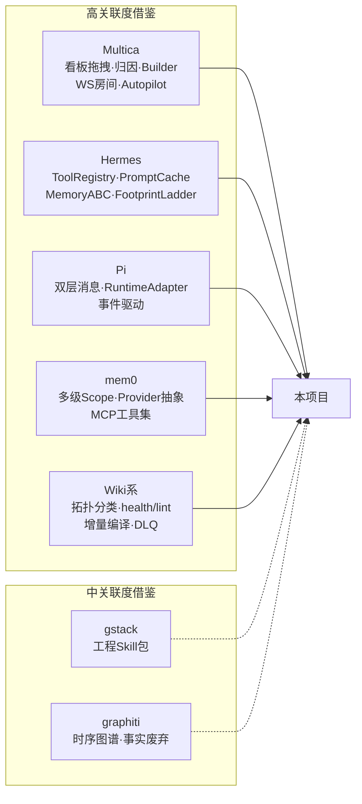

# 多智能体编排平台 · 全面差距分析与切片发展规划

> **调研时间:** 2026-07-26  
> **方法:** 4 个子代理并行深入调研——后端 API 功能 · 前端交互体验 · Multica 源码 · 11 个参考项目  
> **北星:** 本地版 Multica 控制台体验（日常可用、可演进），非 daemon/云协议 1:1  
> **前置:** [multica-gap-2026-07-17.md](file:///d:/code/multi-agent/app/.progress/multica-gap-2026-07-17.md) · [gap-analysis-2026-07-24.md](file:///d:/code/multi-agent/app/.progress/gap-analysis-2026-07-24.md)

---

## 一、当前产品全景

### 1.1 已建成的基座（~90% 日用覆盖）

````carousel
### 🔧 后端能力全景

| 维度 | 现状 |
|---|---|
| **API 端点** | 18 个路由文件，60+ 个端点，覆盖 Issues/Agents/Squads/Runs/Chat/Wiki/Memory/Inbox/Automation/Settings |
| **数据库** | SQLite + Drizzle ORM，22 张核心表，Zod 强类型共享 |
| **执行层** | 4 个 RuntimeBackend 适配器 (claude-code / opencode / cursor / grok) |
| **实时通信** | WebSocket + EventBus，全量广播 + 30s 心跳探针 |
| **Wiki** | 编译式知识库 + Ingest 队列 + DLQ 重试 + health/lint 诊断 |
| **Memory** | 双 Provider (SQLite FTS + pgvector) + 自动降级 |
| **Automation** | interval/daily 调度 + 幂等保障 + 模板引擎 |
| **可靠性** | Orphan Run 收尸 + Heartbeat + Watchdog + 进程树清理 |
<!-- slide -->
### 🎨 前端能力全景

| 维度 | 现状 |
|---|---|
| **页面路由** | 21 个页面（看板/Issue/Agent/Squad/Run/Chat/Wiki/Memory/Inbox/Automation/Settings/Usage 等） |
| **组件库** | 60 个自研组件，纯 CSS Design System，零框架依赖 |
| **状态管理** | React Query v5 + Zustand (WS/RunProgress) + Context (Theme/Density/Toast) |
| **实时交互** | WebSocket 指数退避重连 + React Query 精准失效 + 流式 Token 渲染 |
| **快捷键** | Linear 式体系 (Cmd+K / Q / C / g+i/n/r/s / ? / Esc) |
| **看板** | @dnd-kit 跨列拖拽 + 7 列状态 + 多维筛选 + 批量操作 |
| **主题** | Light/Dark + 防闪烁 FOUC + CSS 变量全量覆盖 |
| **密度** | Compact / Default / Comfortable 三档可选 |
| **空态/错误** | EmptyState 通用组件 + ErrorBoundary + Skeleton 骨架屏 |
````

### 1.2 我们独有的超车能力（Multica 不具备）

| 能力 | 说明 |
|---|---|
| 🏗️ **编译式 Wiki** | `llm-wiki-pattern` + 自动编译 + AGENTS.md Bridge + health/lint/query |
| 🧠 **显式 Memory 引擎** | 可插拔双 Provider + 批量管理 + 运行自动沉淀 + 向量检索自动注入 Prompt |
| 🏥 **Settings 健康卡矩阵** | 多 CLI Live 进程探针 + DB/Env 全方位诊断 |
| 🚀 **Runs Mission Control** | 批量取消 + 收尸恢复 + 活跃计数角标 |
| ⌨️ **CmdK 命令面板** | 全局搜索与快捷跳转 |
| 🔒 **Git dirty 探针** | 派活安全闸 + 失败/ready 运营深链网 |
| 📦 **纯本地零依赖** | Node.js + SQLite，无需 PostgreSQL/Redis/Docker |

---

## 二、差距全景（后端 × 前端 × 交叉）

### 2.1 后端功能缺口

| ID | 缺口 | 现状 | 参考来源 | 优先级 | 复杂度 |
|---|---|---|---|---|---|
| **B-01** | **CLI 适配器深度不均衡** | claude-code 支持 Session Resume/Token 解析/Thinking Level；opencode/cursor/grok 仅基础 stdout 捕获 | Multica `pkg/agent/` 6 种 Backend 均衡实现 | 🟡 P1 | 中 |
| **B-02** | **WebSocket 房间/频道切割** | 全量广播，前端自行过滤 | Multica `realtime.Hub` 三种房间 (`workspace:*` / `task:*` / `chat:*`) | 🟡 P1 | 中 |
| **B-03** | **自动化触发类型有限** | 仅 interval_minutes / daily_at | Multica Autopilot: Cron + GitHub/GitLab/Lark/Slack Webhook | 🟢 P2 | 高 |
| **B-04** | **Token 成本精确归因** | 基础 Usage 聚合 | Multica `attribution.go`: 精确到 Issue/Agent/Project 的 USD 成本 | 🟡 P1 | 中 |
| **B-05** | **Agent Builder 引导式创建** | Settings/Roster 手动添加 | Multica `agenttmpl` 交互式 Builder + 模板库 | 🟢 P2 | 中 |
| **B-06** | **ToolRegistry 自注册 + Dispatch-never-raises** | 无统一工具注册 | Hermes `ToolRegistry` + 异常→JSON 字符串自愈 | 🟢 P2 | 中 |
| **B-07** | **Prompt Cache 保护策略** | 无显式保护 | Hermes `system_and_3`: System 静态 + 临时上下文进 User 消息 | 🟡 P1 | 低 |
| **B-08** | **Cron 表达式调度器** | 仅简单 interval/daily | gstack / Multica Autopilot 完整 Cron 支持 | 🟢 P2 | 低-中 |
| **B-09** | **AgentMessage 双层分离** | Run 消息混合 UI/LLM 关注 | Pi `AgentMessage` vs `LLM Message` + `convertToLlm` 边界 | 🟢 P2 | 高 |
| **B-10** | **Memory Scope 多级隔离精化** | 基础四级 scope | mem0 User/Session/Agent/Run + Reranker 融合检索 | 🟢 P2 | 中 |

### 2.2 前端体验缺口

| ID | 缺口 | 现状 | 参考来源 | 优先级 | 复杂度 |
|---|---|---|---|---|---|
| **F-01** | **富文本编辑器 + Live @Mention** | 纯 Textarea 评论框 | Multica TipTap + `@agent` 自动补全 + 触发预览 | 🔴 P0 | 高 |
| **F-02** | **看板大量 Issue 虚拟滚动** | 全量 DOM 渲染 | 业界标准 Virtual Scrolling (`react-window` / `tanstack-virtual`) | 🟡 P1 | 中 |
| **F-03** | **Chat 打字机自动吸底** | 无 Autoscroll Anchor | Multica Chat 实时流自动锚定底部 | 🟡 P1 | 低 |
| **F-04** | **自定义下拉替代原生 Select** | 部分使用原生 `<select>` | 统一 Custom Dropdown 组件 | 🟡 P1 | 低 |
| **F-05** | **弹窗 Focus Trap** | 弹窗层无焦点锁定 | a11y 规范要求 | 🟡 P1 | 低 |
| **F-06** | **侧滑 Split Sheet 详情** | 全页跳转 | Multica Linear 风格左列表右详情侧滑 | 🟢 P2 | 高 |
| **F-07** | **Agent 实时脉冲状态徽章** | 静态状态标签 | Multica `idle`(灰) / `working`(蓝呼吸灯) / `blocked`(橙) | 🟡 P1 | 低 |
| **F-08** | **Wiki 知识图谱可视化** | 纯列表浏览 | llm-wiki-agent `vis.js` 图谱 + deepwiki Mermaid 架构图 | 🟢 P2 | 中 |
| **F-09** | **窄屏/移动端响应式** | 桌面优化，侧栏无抽屉遮罩 | 1024px 断点适配 + 抽屉式侧栏 | 🟢 P2 | 中 |
| **F-10** | **WS 断线重连精准刷新** | 重连后全量 invalidate 所有 Query | 仅刷新当前视图 Queries，降低重连成本 | 🟡 P1 | 低 |

### 2.3 上一版遗留缺口（GAP-05~08, 11~17 仍开放）

| 原 ID | 缺口 | 当前分析更新 |
|---|---|---|
| GAP-05 | Issue 自定义字段 | 仍有效，Schema 已有 `customFields` JSON 列，需前端编辑 UI |
| GAP-06 | 流式实时反馈加深 | 已有基础流式，可进一步加深色块+partial 文本体验 |
| GAP-07 | Keyboard Shortcuts 设置页 | 快捷键已实现功能，缺设置/自定义页面 |
| GAP-08 | 通知偏好/细粒度订阅 | Inbox 后端已有，缺前端偏好设置 UI |
| GAP-11 | Agent 委派子代理 | 后端 `subagent-dispatch.ts` 已有基础，需 UI 可视化 |
| GAP-12 | Tool Registry 可视化 | 参考 Hermes ToolRegistry 设计 |
| GAP-13 | Context Compression | 参考 Hermes Prompt Cache 策略 |
| GAP-14 | Wiki 交叉项目索引 | 参考 openwiki Git diff 增量 |
| GAP-15~17 | Session 持久化 / API Token / 协作设置 | 远期 |

---

## 三、参考项目借鉴矩阵



---

## 四、未来切片发展规划（12 刀 · 分三期）

> **原则：** 每刀端到端可演示；体验感知优先；后端基建为体验服务；刀间低耦合可并行或跳做。

### 第一期：体验纵深（高感知 · 4 刀）

这一期聚焦用户日常使用中**最能感知到差距**的体验点。

| # | 切片名 | 涉及缺口 | 复杂度 | 关键技术点 | 预期效果 |
|---|---|---|---|---|---|
| **S1** | **富文本评论 + Live Mention** | F-01 | 高 | TipTap 编辑器集成 + `@agent` 自动补全 + 触发预览 Pill + 工具栏 | 评论体验从 Textarea 升级到 Linear 级别 |
| **S2** | **Agent 实时脉冲 + WS 精准刷新** | F-07, F-10, B-02 | 中 | WS 添加 topic 过滤 + Agent 状态脉冲 CSS 动画 + 重连精准 invalidate | 控制台"活"起来，Agent 工作状态一目了然 |
| **S3** | **Token 成本归因面板** | B-04 | 中 | Run 级 Token 归因 → Issue/Agent/Project 聚合 → 图表可视化 | 使用成本可追踪，运营决策有数据 |
| **S4** | **Issue 自定义字段 UI** | GAP-05 | 中 | `customFields` JSON → 前端动态表单渲染 + 字段管理 CRUD | Issue 灵活性对齐 Multica |

### 第二期：编排加深（核心能力 · 4 刀）

这一期聚焦编排核心能力的**深度补全**。

| # | 切片名 | 涉及缺口 | 复杂度 | 关键技术点 | 预期效果 |
|---|---|---|---|---|---|
| **S5** | **CLI 适配器均衡化** | B-01 | 中 | opencode/cursor 补齐 Token 解析 + Session Resume + 结构化输出 | 多 CLI 体验一致，非 claude-code 用户不掉队 |
| **S6** | **Cron 表达式 + 自动化加深** | B-03, B-08 | 中 | 引入 Cron 表达式解析器 + 规则预览 (next N runs) + 手动 dry-run | 自动化能力从"能用"到"好用" |
| **S7** | **Agent Builder 引导式创建** | B-05 | 中 | 步骤式向导 (选 Runtime → 配 Model → 选 Skills → 设 Instructions) + 模板库 | 新用户 Agent 创建体验提升 |
| **S8** | **子代理委派可视化** | GAP-11 | 中-高 | `parentRunId` 树状展开 + 委派链路图 + 父侧摘要收集 | 复杂任务执行过程透明可观测 |

### 第三期：知识与工程深度（长期演进 · 4 刀）

这一期聚焦知识层和工程规范的**纵深能力**。

| # | 切片名 | 涉及缺口 | 复杂度 | 关键技术点 | 预期效果 |
|---|---|---|---|---|---|
| **S9** | **Wiki 知识图谱 + 增量编译** | F-08, GAP-14 | 中 | vis.js 关系图谱前端 + SHA256 diff 增量 Ingest + 交叉项目索引 | Wiki 从列表变成可探索的知识网络 |
| **S10** | **ToolRegistry + Prompt Cache** | B-06, B-07 | 中 | 统一 Tool 注册中心 + dispatch-never-raises + System Prompt 静态化策略 | Agent 工具管理可视化，Prompt 成本降低 |
| **S11** | **Memory 高级检索 + 图谱** | B-10 | 高 | Reranker 融合检索 + 事实时效窗口 + Entity 关系可视化 | 记忆从"存取"到"理解" |
| **S12** | **Side Panel 详情 + 虚拟滚动** | F-02, F-06 | 高 | Linear 式左列表右详情侧滑 + tanstack-virtual 大列表优化 | 整体导航体验质变 |

### 迭代路径可视化

```mermaid
gantt
    title 切片发展路径（建议顺序 · 非严格时间轴）
    dateFormat X
    axisFormat %s

    section 第一期 · 体验纵深
    S1 富文本 + Mention          :s1, 0, 3
    S2 Agent 脉冲 + WS 精准      :s2, 0, 2
    S3 Token 成本归因             :s3, 2, 4
    S4 自定义字段 UI              :s4, 3, 5

    section 第二期 · 编排加深
    S5 CLI 适配器均衡             :s5, 4, 6
    S6 Cron + 自动化加深          :s6, 5, 7
    S7 Agent Builder              :s7, 6, 8
    S8 子代理委派可视化           :s8, 7, 9

    section 第三期 · 知识深度
    S9 Wiki 图谱 + 增量           :s9, 8, 10
    S10 ToolRegistry + Cache      :s10, 9, 11
    S11 Memory 高级检索           :s11, 10, 12
    S12 Side Panel + 虚拟滚动     :s12, 10, 12
```



---

## 五、体验打磨项（可穿插在任意切片中完成）

这些是**低复杂度高感知**的体验改善，可在任意切片开发中顺带处理：

| ID | 改善点 | 复杂度 | 说明 |
|---|---|---|---|
| UX-01 | Chat 打字机自动吸底 (F-03) | 低 | Intersection Observer 锚定底部 |
| UX-02 | 自定义下拉替代原生 Select (F-04) | 低 | 统一 Custom Dropdown 组件 |
| UX-03 | 弹窗 Focus Trap (F-05) | 低 | a11y 焦点锁定 |
| UX-04 | 快捷键设置页 (GAP-07) | 低 | 展示+自定义快捷键映射 |
| UX-05 | 通知偏好设置 (GAP-08) | 低 | Inbox 偏好前端 UI |
| UX-06 | 流式色块加深 (GAP-06) | 低-中 | ANSI 色块 + partial 文本气泡优化 |
| UX-07 | 窄屏响应式 (F-09) | 中 | 1024px 断点 + 抽屉侧栏 |

---

## 六、刻意不做（仍有效 · 不挡排期）

| 边界 | 原因 |
|---|---|
| 云 webhook / 多租户 / Redis | 宪法「纯本地」约束 |
| Multica daemon 协议 1:1 | Backend adapter 学接口不学进程模型 |
| 密钥入库 / UI 写密钥 | ADR 0003 安全约束 |
| 多端客户端 (Electron/Mobile) | Web 控制台已满足日用；如需桌面可后期 Tauri 包装 |
| Composio 三方 SaaS 集成 | Multica 偏云端/SaaS，我们保持纯本地 CLI Skills |
| 跨 Runtime Session 迁移 | 成本过高，非必需 |

---

## 七、决策要点

> [!IMPORTANT]
> **以下决策点影响整体排期方向，请审阅后给出偏好。**

1. **第一期 4 刀的优先级排序** — 当前建议 S1(富文本) > S2(脉冲) > S3(归因) > S4(字段)，是否需要调整？
2. **富文本编辑器选型** — TipTap（Multica 用）vs Milkdown vs Plate？TipTap 社区最大但包体较重。
3. **WS 房间模型** — 是否引入 topic 过滤（轻量方案）还是完整房间模型（Multica 方案）？建议先做轻量 topic 过滤。
4. **三期节奏** — 是否严格按一期完成再开二期，还是允许跨期穿插（如 CLI 均衡化 S5 可提前到一期）？
5. **体验打磨项** — 是否在每刀中固定分配 ~10% 精力处理 UX 小项，还是集中一刀专门打磨？
