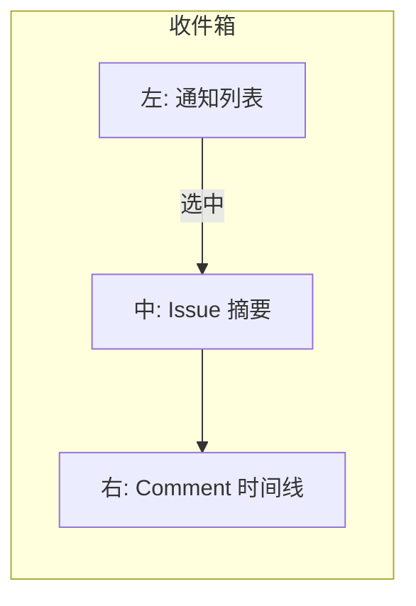
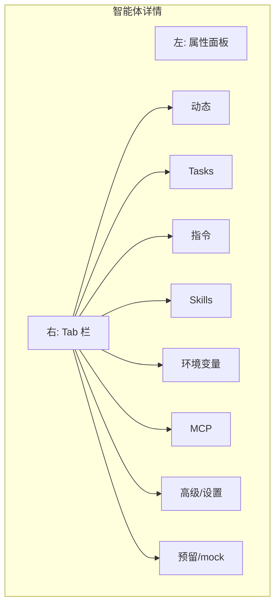
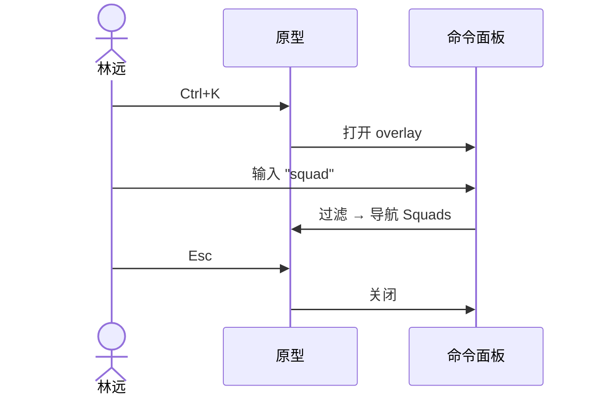

# PRD 增补：V2 Multica UI Replica

> 本文档为 [`multi-agent-platform.md`](./multi-agent-platform.md) 的 **V2 章节**。  
> **RTM 增量（优先）**：[`multi-agent-platform-rtm-v2.md`](./multi-agent-platform-rtm-v2.md) — **88 条 UI-* Must REQ**（+ 22 Should）。  
> **截图清点**：[`multica-ui-replica-inventory.md`](./multica-ui-replica-inventory.md) — 逐张 Read `multica-image/ref1–ref18`。

---

## 1. 背景与动机

V1 原型验证了 **Must 功能骨架**（32 REQ）：看板拖拽、Squad briefing、Agent/Skill、暗色三栏、Wiki 占位。队长对照 Multica 截图后确认：**方向正确，但差距在信息架构 + 视觉保真 + 页面完整度**，非「缺几个按钮」。

V2 目标：在 **Won't 不变**（无 CLI/DB/WS/真实 GitHub）前提下，将原型提升为 **Multica 截图级 UI Replica** —— 全部页面 shell 可点通、mock 数据填充、视觉对齐暗色控制台。

---

## 2. V1 vs V2 差异总览

| 维度 | V1 MVP 骨架 | V2 Multica Replica |
|------|------------|-------------------|
| **定位** | 证明 Must 路径可点通 | 证明「这就是 Multica 式控制台」+ Wiki 增量 |
| **左栏** | 4 项平铺 | 搜索+新建、收件箱/我的 Issue、工作区 6 项、配置 3 项 |
| **Issue 看板** | 3 列 backlog/running/done | **5 列** + 筛选 Tab + 看板/列表切换 |
| **Issue 卡片** | ID + 标题 + badge | + 描述摘要 + 相对时间 + 视觉密度对齐截图 |
| **收件箱** | 无 | **三栏**：列表 + 详情 + 时间线 |
| **新建 Issue** | 无 | **智能体/手动** 双模态 + 完整表单字段 |
| **小队** | 右栏 briefing 片段 | **列表页 + 详情页**（成员 Tab / 指令 Tab） |
| **智能体** | 简单 CRUD 向导 | **双栏详情 + 8 Tab** |
| **Skills** | URL 导入表单 | **表格页** + 搜索筛选 + 四列 |
| **设置** | 无 | **二级导航** 设置壳 |
| **Runtime** | runtime 下拉 | **机器列表 + Runtime 表格** |
| **全局** | 无 | **Ctrl+K**、顶栏 Tab、working 计数 |
| **Wiki** | 独立简陋导航 | **嵌入 Multica 侧栏 IA**，保留 5 页 mock |
| **Won't** | 不变 | 不变 |

---

## 3. V2 范围（MoSCoW）

### Must（V2 原型必须交付）

1. 完整 **Multica 侧栏 IA**（UI-NAV-001~008）
2. **5 列 Issue 看板** + 筛选 + 视图切换 + 富卡片（UI-ISS-001~005, 010~011）
3. **收件箱三栏**（UI-ISS-006）
4. **新建 Issue 双模态** + 手动表单全字段（UI-ISS-007~008）
5. **小队列表 + 详情**（成员/指令 Tab）（UI-SQD-001~006）
6. **智能体列表 + 双栏 8 Tab 详情**（UI-AGT-001~010）
7. **Skills 表格页** + 搜索 + URL 导入（UI-SKL-001~004）
8. **设置二级导航** 4 页壳（UI-SET-001~004）
9. **Runtime 机器 + 表格**（UI-RT-001~003）
10. **Ctrl+K 命令面板**（UI-CMD-001~004）
11. **Wiki 嵌入工作区导航**（UI-WIK-001~003）
12. **暗色视觉对齐** multica-image（UI-NAV-008）
13. **V1 答辩路径回归**（FRI-11、产品小队、@mention）

### Should

- 智能体创建 Tab（UI-ISS-009）
- 命令面板 recent（UI-CMD-005）
- Agent 第 8 Tab 命名对齐截图（UI-AGT-011）
- Skill 行详情（UI-SKL-005）
- Runtime 行展开（UI-RT-004）
- 顶栏视图 Tab（UI-NAV-009）
- 设置成员页（UI-SET-005）
- `test_must_paths.py` V2 扩展断言

### Won't（与 V1 一致，禁止渗入 V2 Must）

- 真实 CLI 执行 / daemon spawn
- PostgreSQL / WebSocket / Redis
- 真实 GitHub Skill 拉取 / SKILL.md 解析
- 真实 runtime 发现（LookPath）
- Sub-issue / Stage / metadata KV
- Wiki ingest / Memory 向量检索
- 企业 RBAC / 多租户 / 计费

---

## 4. 信息架构（V2）

### 4.1 左栏结构

```
┌─────────────────────────┐
│ [🔍 搜索...]  [+ 新建 ▾] │  ← UI-NAV-001
├─────────────────────────┤
│ 📥 收件箱            (3) │  ← UI-NAV-002
│ 📋 我的 Issue            │  ← UI-NAV-003
├─ 工作区 ─────────────────┤
│ ◫ Issues                 │
│ ◎ Agents                 │
│ 👥 Squads                │  ← UI-NAV-004 (6项)
│ ⚡ Skills                │
│ 🖥 Runtime               │
│ 📖 Wiki                  │
├─ 配置 ───────────────────┤
│ ⚙ Settings               │
│ ⏱ Autopilot (mock)       │  ← UI-NAV-005 (3项)
│ 🧠 Memory (mock)         │
└─────────────────────────┘
```

### 4.2 顶栏（UI-NAV-006, UI-NAV-009）

```
[ 毕设 Multi-Agent ▾ ]  Issues | 看板 | 列表     [ 0 working ]  [?]
```

### 4.3 页面清单

| 页面 | 布局模式 | REQ |
|------|----------|-----|
| Issues 看板 | 顶栏 + 筛选 Tab + **5 列 kanban** + 可选右栏 | UI-ISS-001~005 |
| Issues 列表 | 顶栏 + 表格 | UI-ISS-004 |
| 收件箱 | **三栏**：列表 \| 详情 \| 时间线 | UI-ISS-006 |
| 新建 Issue | 居中模态，双 Tab | UI-ISS-007~009 |
| Squads 列表 | 主区表格 | UI-SQD-001 |
| Squad 详情 | 顶栏 + Tab（成员/指令） | UI-SQD-002~004 |
| Agents 列表 | 主区表格/卡片 | UI-AGT-001 |
| Agent 详情 | **双栏** + 8 Tab | UI-AGT-002~009 |
| Skills | 筛选栏 + **表格** | UI-SKL-001~003 |
| Settings | **左二级 nav** + 内容 | UI-SET-001~004 |
| Runtime | 机器区 + **表格** | UI-RT-001~002 |
| Wiki | Multica 壳 + 树 + 阅读区 | UI-WIK-001~003 |
| 命令面板 | 全局 overlay | UI-CMD-001~003 |

### 4.4 看板 5 列映射

| 列名（UI 中文） | 内部 status key | V1 映射 |
|----------------|-----------------|---------|
| 待规划 | `planning` | 从 backlog 拆分 |
| 待办 | `backlog` | backlog |
| 进行中 | `running` | running |
| 审核中 | `in_review` | 原可选第四列 |
| 已完成 | `done` | done |

Seed 需覆盖 5 列均有 ≥1 卡片（可 6–10 Issue 总量不变）。

---

## 5. 视觉规范（对齐 multica-image）

### 5.1 原则

- **默认暗色**（继承 V1 NAV-004 决策）
- 侧栏略深于主区；卡片有 1px 边框 + 微阴影
- 列头：中文 + 计数 `(n)` + 顶部色条或 dot
- 字体：UI  sans + identifier mono
- 圆角：卡片 8px、按钮 6px、模态 12px
- hover/focus 态必须可见（答辩可演示）

### 5.2 Token 扩展（相对 V1 tokens.css）

| Token | 建议值 | 用途 |
|-------|--------|------|
| `--sidebar-bg` | `#0a0a0f` | 左栏背景 |
| `--surface-1` | `#12121a` | 主区背景 |
| `--surface-2` | `#1a1a26` | 卡片 |
| `--border-subtle` | `#2a2a3a` | 分隔线 |
| `--text-primary` | `#ececf1` | 正文 |
| `--accent` | `#6366f1` | 链接/选中 |
| `--badge-squad` | `#8b5cf6` | 小队 badge |
| `--col-planning` | `#64748b` | 待规划 |
| `--col-backlog` | `#94a3b8` | 待办 |
| `--col-running` | `#3b82f6` | 进行中 |
| `--col-review` | `#f59e0b` | 审核中 |
| `--col-done` | `#22c55e` | 已完成 |

队长签核时以 **multica-image/ 并排对比** 为准，非 pixel-perfect 但 IA 与密度须一致。

---

## 6. 交互流程图

### 6.1 收件箱三栏（UI-ISS-006）



### 6.2 Agent 详情 8 Tab（UI-AGT-003~008）



### 6.3 命令面板（UI-CMD-001~003）



---

## 7. Seed 数据增量（V2）

在 V1 seed 基础上扩展，**不删除** FRI-11 与产品小队：

| 实体 | V1 | V2 增量 |
|------|-----|---------|
| Issue | 8 条，3 status | 映射到 5 列；卡片加 `summary`、`relativeTime` |
| Inbox | 无 | 3–5 条 mock 通知，链接到 Issue |
| Squad | 1 | 加 `description`、`protocol` 字段供指令 Tab |
| Agent | 4 | 加 `activity[]`、`tasks[]`、`envVars[]` mock |
| Skill | 4 | 加 `usedBy[]`、`addedBy`、`updatedAt` |
| Machine | 无 | 1 台 localhost |
| Runtime | 下拉字符串 | 3–4 行：Pi/Claude/opencode + health/cost/version |
| Settings | 无 | profile/preferences/workspace mock |

---

## 8. 验收与测试

### 8.1 V1 回归（必须通过）

- 现有 `prototype/test_must_paths.py` 全部通过
- FRI-11 答辩路径 ≤3 分钟

### 8.2 V2 增量测试（队员 3 扩展）

建议新增断言：

```python
# V2 smoke examples
assert page.locator(".kanban-col").count() == 5
page.keyboard.press("Control+K")
assert page.locator(".command-palette").is_visible()
page.locator('[data-nav="squads"]').click()
assert page.locator("text=产品小队").count() >= 1
page.locator('[data-nav="runtime"]').click()
assert page.locator("th:has-text('健康度')").count() >= 1
```

### 8.3 队长 pm-critic 目视清单

- [ ] 侧栏 IA 与 multica-image 一致
- [ ] 5 列看板列名中文正确
- [ ] 收件箱三栏同屏
- [ ] Agent 8 Tab 可切换
- [ ] Skills 为表格非表单
- [ ] Ctrl+K 可用
- [ ] Wiki 在侧栏第 6 项且壳一致
- [ ] Won't 未实现真实后端

---

## 9. 依赖与风险

| 风险 | 缓解 |
|------|------|
| 截图与本地 multica-image 不同步 | 以 Issue 附件为真源；IA 文档标注截图文件名 |
| V2 scope 挤压答辩路径 | UI-ISS-010 强制 V1 回归；P0 先保 FRI-11 |
| 8 Tab 内容空洞 | Must 仅要求 shell 可切换；内容 mock 一两行即可 |
| 视觉 diff 主观 | 队长并排截图签核，非自动化 pixel diff |

---

## 10. 交付物清单

| 交付物 | 负责人 | 路径 |
|--------|--------|------|
| RTM V2 增量 | 队员 2 ✅ | `docs/prd/multi-agent-platform-rtm-v2-increment.md` |
| V2 PRD 章节 | 队员 2 ✅ | 本文档 |
| PRODUCT-BRIEF 更新 | 队员 2 ✅ | `PRODUCT-BRIEF.md` |
| 高保真原型 | 队员 3 | `prototype/` |
| IA 更新 | 队员 3 | `docs/design/multi-agent-platform-ia.md` |
| 测试扩展 | 队员 3 | `prototype/test_must_paths.py` |

---

## Revision History

| Version | Date | Author | Changes |
|---------|------|--------|---------|
| 2.0 | 2026-07-08 | 产品·需求与PRD官 | V2 Multica UI Replica 初版 |
