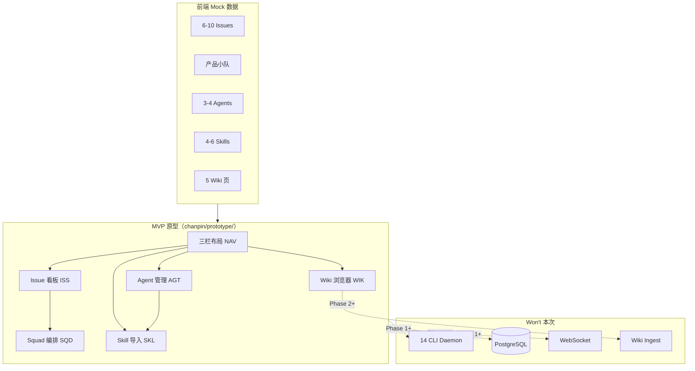
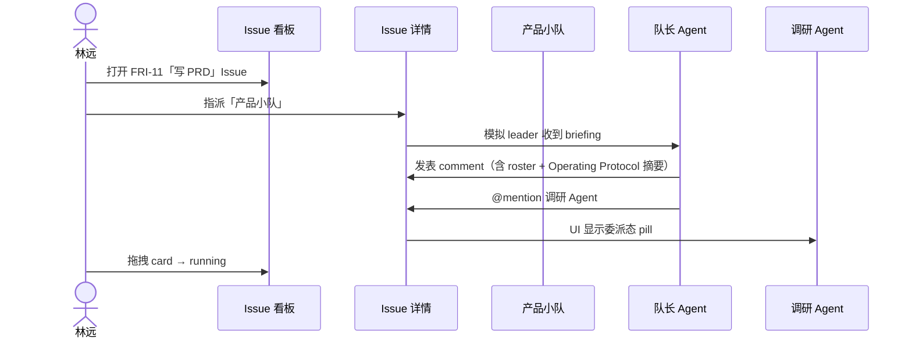

# PRD: 毕设 Multi-Agent 平台 — MVP 可交互原型

> **V2 增补（2026-07-08）**：队长反馈后新增 Multica UI Replica 范围。  
> - **截图清点（真源）**：[`multica-ui-replica-inventory.md`](./multica-ui-replica-inventory.md) — 逐张 Read 18 PNG  
> - **RTM V2 增量（优先开工）**：[`multi-agent-platform-rtm-v2.md`](./multi-agent-platform-rtm-v2.md) — **88 Must + 22 Should**  
> - V2 PRD 章节：[`multi-agent-platform-v2-replica.md`](./multi-agent-platform-v2-replica.md)  
> - 下文为 **V1** 基线，仍有效；V2 为 IA/视觉增量，不替代答辩路径。

## Overview

### Problem Statement

软件工程者在本地使用多个 AI 编码 CLI 时，缺乏统一控制台来编排任务、委派小队、追踪 Issue 时间线，并将执行产出沉淀为可版本化的项目 Wiki 与跨会话记忆。现有工具（Multica、Cursor、WeKnora 等）各自解决编排、执行、RAG 或记忆之一，无法形成「任务 → 执行 → 知识累积」闭环。

完整问题陈述见 [`docs/problem-statement.md`](../problem-statement.md)。

### Solution Summary

交付 **PRD + RTM + 可交互 HTML 原型**（`chanpin/` 目录），覆盖 Must 级能力：

- **Issue 看板**：Trello 式 backlog → running → done，含详情时间线
- **Squad 编排**：队长 briefing + @mention 委派（mock，不 enqueue 真实 Agent）
- **Agent + Skill**：CRUD、runtime 绑定、Skill URL 导入与分配
- **Multica 三栏布局**：左导航 / 主工作区 / 右侧上下文面板
- **Wiki 浏览器占位**：mock 页面树 + 5 页预置内容

**本次不含**真实 CLI 子进程、PostgreSQL、WebSocket、14 CLI daemon。原型用前端 mock 数据，答辩演示「看得见、点得通」的编排闭环。

### Target Users

| Persona | 角色 | 用途 |
|---------|------|------|
| **林远**（主） | 毕设作者 / 本地单用户开发者 | 操作原型、日常 Issue 编排 demo |
| **王教授**（次） | 答辩导师 / 评审 | 10 分钟内读 PRD 摘要 + 点原型理解差异化 |

详见 [`research/personas.md`](../../research/personas.md)。

---

## Goals & Success Metrics

### Goals

1. **Must REQ 100% 可追溯**：每条 Must 需求有 RTM 行 + AC 摘要，无 orphan requirement
2. **4 条主路径可点通**：看板 / Issue 时间线 / Agent+Skill / Squad @mention
3. **答辩高光路径可演示**：Issue → 指派 Squad → 队长 briefing → @mention 成员
4. **差异化可复述**：导师可说明「Multica 级编排 + 本地 Wiki 占位」相对竞品的增量

### Success Metrics

| Metric | Baseline | Target | Timeline |
|--------|----------|--------|----------|
| Must REQ 有 AC | 0 | 100% | Issue 关闭前 |
| 原型 4 条主路径可点通 | 0 | 4/4 | 原型交付前 |
| 导师 10 分钟理解度 | 未测 | 读摘要 + 点原型可复述差异化 | 答辩前 |
| RTM 覆盖率 | 0 | 全部 Must REQ 映射到 US/AC | PRD 签核前 |

### Non-Goals

- 真实 Pi / Claude Code / Cursor headless 子进程执行
- PostgreSQL / WebSocket / Redis 多节点
- 14 CLI daemon 全量路由
- Wiki ingest 管线与 Issue 事件联动实装
- 企业 RBAC / 多租户 / 云端托管
- 本次在 `app/` 写生产代码

---

## User Stories

| ID | User Story | Priority | REQ 域 |
|----|-----------|----------|--------|
| US-ISS-01 | 作为林远，我想在看板上拖拽 Issue 卡片切换状态，以便一屏看清今日 Agent 任务进度 | P0 | ISS |
| US-ISS-02 | 作为林远，我想在 Issue 详情页查看 comment 时间线，以便聚合任务全部推进记录 | P0 | ISS |
| US-ISS-03 | 作为林远，我想将 Issue 指派给 Agent 或 Squad，以便明确执行者 | P0 | ISS |
| US-SQD-01 | 作为林远，我想创建/查看 Squad roster 与队长，以便模拟 multica leader briefing | P0 | SQD |
| US-SQD-02 | 作为林远，我想在 Issue 时间线看到队长 comment 并 @mention 专精 Agent，以便演示小队委派闭环 | P0 | SQD |
| US-AGT-01 | 作为林远，我想创建 Agent 并配置 system prompt、runtime、MCP，以便展示差异化 Agent 配置 | P0 | AGT |
| US-SKL-01 | 作为林远，我想从 GitHub URL 导入 Skill 并分配给 Agent，以便展示 skill 复利 | P0 | SKL |
| US-NAV-01 | 作为林远，我想用 Multica 式三栏布局切换 Issue/Agent/Wiki，以便减少窗口切换 | P0 | NAV |
| US-WIK-01 | 作为林远，我想浏览 mock 项目 Wiki 树并阅读页面，以便答辩时证明知识层存在 | P0 | WIK |
| US-DEMO-01 | 作为王教授，我想在 10 分钟内点通预置 demo 路径，以便评估系统设计与 Related Work | P0 | SQD+ISS |

完整 AC 见 [`multi-agent-platform-rtm.md`](./multi-agent-platform-rtm.md) 与 [`docs/hand/`](../handoff/)。

---

## Scope

### In Scope（Must — 原型必须可演示）

| 模块 | 能力 |
|------|------|
| **ISS** | 看板 3–4 列、卡片拖拽、详情页、comment 时间线、assignee 多态（agent/squad）、identifier 编号 |
| **SQD** | Squad 实体、leader 高亮、roster、Issue 指派 Squad、briefing 摘要、@mention pill |
| **AGT** | Agent CRUD、system instructions、runtime 下拉（mock）、MCP 配置入口 |
| **SKL** | Skill URL 导入 UI、列表、按 Agent 多选分配 |
| **NAV** | 三栏布局、左栏导航（Issues/Agents/Skills/Wiki）、右栏随选中项切换 |
| **WIK** | Wiki 导航树、5 页 mock 内容阅读 |
| **Demo 数据** | 预置 1 个「产品小队」+ 6–10 条 mock Issue |

### Out of Scope（Won't — 禁止渗入 Must AC）

- 真实 CLI spawn / daemon / task 状态机
- PostgreSQL、WebSocket、DB 行即锁
- Sub-issue / Stage / Issue metadata KV
- 14 CLI runtime 发现（LookPath）
- Wiki ingest、Issue 完成触发、向量检索
- Autopilot scheduler 实装（Should 级表单 UI 可选）
- Memory 检索实装（Should 级 mock 面板可选）
- 人类 squad 成员、Inbox 通知、企业 RBAC

### Future Considerations

| Phase | 内容 | 理由 |
|-------|------|------|
| Phase 0 `app/` | SQLite + 单进程 API | 原型验证后再写后端 |
| Phase 1 | Backend adapter（Pi/Claude/opencode）真实 spawn | 执行层，非本次原型 |
| Phase 2 | Wiki ingest + Issue 事件联动 | 论文创新点 |
| Phase 2+ | Memory 可插拔（mem0/graphiti） | Should mock 已占位 |
| Phase 3+ | Autopilot Cron/Webhook | Multica 完整能力 |

---

## Solution Design

### 架构概览



### 答辩高光路径（Demo Script）



**原型前置约束（强制）：**

1. 预置 **1 个「产品小队」**：队长 = 「产品·策划队长」Agent，成员 ≥ 2（调研、PRD、原型 Agent）
2. 预置 **6–10 条 mock Issue**，至少 1 条处于「可演示 Squad 委派」状态（如 FRI-11）
3. 时间线预填 2–3 条 comment（human + agent 混合），含 1 条带 @mention 的队长 comment
4. 答辩 demo 路径固定：**Issue → Squad → briefing → @mention**（≤ 3 分钟可完成）

### 功能需求摘要

#### ISS — Issue 看板与时间线

- 看板列：`backlog` | `running` | `done`（可选 `in_review` 第四列）
- 卡片显示：identifier（如 FRI-11）、标题、assignee badge、优先级色条
- 拖拽切换状态，右栏同步更新 Issue 属性
- 详情页：标题、描述、assignee 下拉（Agent / Squad）、comment 时间线
- @mention 在 comment 中渲染为可点击 pill（mock，不触发 enqueue）

#### SQD — Squad 编排

- Squad 列表 + 详情：名称、leader 高亮、roster（agent 成员）
- Issue assignee_type=squad 时，右栏展示 briefing 摘要（Operating Protocol + Roster + 自定义指令三段结构，学 `squad_briefing.go`）
- 队长 comment 含 `[@Name](mention://agent/<uuid>)` 格式链接

#### AGT — Agent 定义

- Agent 列表 + 创建/编辑向导（2 步：基本信息 → runtime/skills）
- 字段：名称、system instructions（多行）、runtime 下拉、MCP servers 列表（可空）
- Runtime 选项（mock 静态列表）：`Pi` | `Claude Code` | `opencode` | `Cursor`（见 Open Questions 决策）
- Agent 状态 badge：idle / working（Should，静态 mock 即可）

#### SKL — Skill 导入

- URL 输入框（GitHub / 示例 URL）→ 点击导入 → 列表新增条目
- Agent 详情页 skill 多选 checkbox 分配
- 不要求 SKILL.md 编辑器或本地目录扫描

#### NAV — 三栏布局

- **左栏**（固定 ~240px）：Workspace 名、Issues、Agents、Skills、Wiki 导航项
- **主区**：看板 / 列表 / 详情 / Wiki 阅读器
- **右栏**（~320px）：选中 Issue 属性、Agent 详情、Activity 摘要
- **默认暗色主题**（见 Open Questions 决策）

#### WIK — Wiki 浏览器

- 左树形导航 + 主区 Markdown 渲染（mock HTML）
- 5 页预置（见 Open Questions 决策），对齐 `llm-wiki-pattern` 顶层结构

### User Experience

| 决策 | 选择 | 理由 |
|------|------|------|
| 视觉参考 | Multica 控制台 + Trello 看板 | 林远决策模式「参考优先」 |
| 默认 landing | Issue 看板 | JTBD 主 Job = 编排可见性 |
| 交互深度 | 可点击状态流转 + 面板切换，非静态截图 | PRODUCT-BRIEF 风险对策 |
| 空态 | 各模块有引导文案，但 demo 数据预填避免空态 | 答辩操作成本 |
| 响应式 | 桌面 ≥ 1280px 优先；移动端不要求 | 答辩场景为 laptop demo |

### Edge Cases

| Scenario | Expected Behavior |
|----------|------------------|
| 拖拽 Issue 到同一列 | 无状态变更，无报错 |
| Assignee 切换 Agent → Squad | 右栏 briefing 区域出现/消失 |
| 导入重复 Skill URL | 提示「已存在」或静默 dedupe（mock 二选一，原型实现时定） |
| Wiki 树选中叶节点 | 主区渲染对应 mock 页面 |
| 右栏无选中项 | 显示 Workspace 摘要或最近 Activity |
| @mention 不存在的 Agent | 渲染为 plain text，不 crash |
| 刷新页面 | mock 状态重置为初始 seed（localStorage 可选 Should） |

---

## Technical Considerations

### Constraints

- **纯前端 mock**：HTML/CSS/JS 或轻量框架（队员 3 选型），无 backend API 依赖
- **输出路径**：`D:\code\multi-agent\chanpin\prototype/`
- **输入真源只读**：`D:\code\multi-agent\design/`、`references/` 不修改
- **单 Workspace**：无 workspace 切换 UI（Should 级顶栏可省略）
- **单用户**：无 auth / RBAC

### Integration Points（Phase 1+ 预留，本次仅 UI 入口）

| 系统 | 本次 | Phase 1+ |
|------|------|----------|
| Pi SDK | runtime 下拉选项 | Backend adapter spawn |
| Claude Code CLI | runtime 下拉选项 | daemon 绑定 |
| Cursor | runtime 下拉选项（UI only） | headless 能力 TBD |
| MCP servers | Agent 配置空列表 + 添加按钮 | 真实 MCP 配置 JSON |
| llm-wiki | Wiki mock 结构对齐 | ingest 管线 |

### Data Requirements

原型 seed 数据结构建议：

```typescript
// 示意 — 非实现代码，供原型队员参考
interface Issue {
  id: string;
  identifier: string;  // "FRI-11"
  title: string;
  status: 'backlog' | 'running' | 'done' | 'in_review';
  assignee?: { type: 'agent' | 'squad'; id: string };
  comments: Comment[];
}
interface Squad {
  id: string;
  name: string;
  leaderId: string;
  memberIds: string[];
}
```

---

## Dependencies & Risks

### Dependencies

| Dependency | Owner | Status | Impact if Delayed |
|------------|-------|--------|-------------------|
| PRODUCT-BRIEF + research | 队长 + 队员1 | ✅ Done | PRD 无输入真源 |
| 本 PRD + RTM | 队员2 | 🔄 本文档 | 阻塞原型 |
| HTML 原型 | 队员3 | ⏳ 待派活 | 阻塞答辩 demo |
| design/synthesis.md | 用户 | ✅ 已有 | Wiki mock 内容来源 |

### Risks

| Risk | L | I | Mitigation |
|------|---|---|------------|
| PRD scope 膨胀到 Phase 4 | H | H | RTM Won't 列 + 队长 MVP 签核 |
| 原型变静态截图 | M | H | AC 要求拖拽 + 面板切换 |
| Open Questions 未决阻塞原型 | M | M | 本文档 §Open Questions 已拍板 |
| 与 Multica 交互不一致 | L | M | multica-feature-matrix 对照表 |

---

## Timeline & Milestones

| Milestone | Description | Target |
|-----------|-------------|--------|
| M0 | PRODUCT-BRIEF + problem-statement | ✅ 2026-07-08 |
| M1 | research/ 交付 | ✅ 2026-07-08 |
| M2 | PRD + RTM + capability + handoff | 2026-07-08 |
| M3 | HTML 可交互原型 Must 路径 | 队长派活后 |
| M4 | utility-pm-critic + MVP 签核 | M3 后 |
| M5 | 答辩 demo 排练 | 答辩前 |

---

## Open Questions（已拍板）

> PRD 负责人在本文档做出 MVP 决策，原型队员按此执行。若有异议由队长复审。

### Q1: 原型默认暗色还是亮色主题？

**决策：默认暗色主题（Dark）。**

| 选项 | 评估 |
|------|------|
| ✅ 暗色 | 对齐 Multica 当前控制台审美；开发者工具惯例；答辩投影对比度好 |
| ❌ 亮色 | 需额外设计 token，无 Must 收益 |
| ❌ 跟随系统 | 增加复杂度，单用户 demo 无必要 |

**REQ 映射：** NAV-004

---

### Q2: Wiki mock 需要几页？是否对齐 llm-wiki-pattern？

**决策：5 页 mock，顶层目录对齐 `llm-wiki-pattern`。**

| 页面 | 路径 | 内容来源 |
|------|------|----------|
| Home | `/wiki/home` | 项目概述（problem-statement 摘要） |
| Architecture | `/wiki/architecture` | design/architecture.md 摘要 |
| Synthesis | `/wiki/synthesis` | design/synthesis.md 摘要 |
| Sprint Log | `/wiki/sprint-log` | mock 迭代记录 |
| Glossary | `/wiki/glossary` | Agent/Squad/Skill 术语表 |

**理由：** 5 页足够答辩叙事（编排 + 知识层），又与 llm-wiki-pattern 顶层一致，不需 ingest 实装。

**REQ 映射：** WIK-001, WIK-002, WIK-003

---

### Q3: Cursor headless/CLI 是否纳入 Phase 1 runtime？

**决策：MVP 原型 — Cursor 作为 runtime 下拉选项（UI mock only）；Phase 1 实装 — 暂不纳入 Must，标记为 Should/TBD。**

| 范围 | Cursor 处理 |
|------|-------------|
| **MVP 原型** | runtime 下拉含 `Cursor` 选项，纯静态，不 spawn |
| **Phase 1 `app/`** | Must runtime = Pi + Claude Code + opencode；Cursor 为 **Should**，待验证 headless API 稳定性 |
| **Won't** | Cursor Background Agents 云端能力、真实 headless 执行 |

**理由：** 林远已日常使用 Cursor IDE，但 Cursor CLI/headless 能力边界未在调研中验证（`problem-statement` Open Question）；MVP 不应被未验证 runtime 阻塞。UI 保留选项即可展示「多 runtime 绑定」概念。

**REQ 映射：** AGT-003（mock 含 Cursor 选项）；Phase 1 见 `product-capability.md` OPEN QUESTIONS

---

## Appendix

### Related Documents

| 文档 | 路径 |
|------|------|
| Product Brief | [`PRODUCT-BRIEF.md`](../../PRODUCT-BRIEF.md) |
| Problem Statement | [`docs/problem-statement.md`](../problem-statement.md) |
| Personas | [`research/personas.md`](../../research/personas.md) |
| JTBD | [`research/jtbd.md`](../../research/jtbd.md) |
| 竞品矩阵 | [`research/competitive-analysis.md`](../../research/competitive-analysis.md) |
| Multica 对标 | [`research/multica-feature-matrix.md`](../../research/multica-feature-matrix.md) |
| RTM | [`multi-agent-platform-rtm.md`](./multi-agent-platform-rtm.md) |
| Capability | [`../product-capability.md`](../product-capability.md) |
| Handoff | [`../handoff/`](../handoff/) |
| 设计真源（只读） | `D:\code\multi-agent\design/` |

### 差异化一句话（答辩用）

> **Multica** 把 14 种 CLI 变成可指派队友，但不管项目 Wiki 与跨会话记忆；**本毕设**在同一控制台证明 Issue 生命周期驱动的编排 UX，并为「编译式 Wiki + 可插拔 Memory」预留入口 — MVP 以 mock 演示 Must 路径，执行与 ingest 在 Phase 0–2 实装。

### Revision History

| Version | Date | Author | Changes |
|---------|------|--------|---------|
| 1.0 | 2026-07-08 | 产品·需求与PRD官 | 初版 — 含 Open Questions 拍板 |
