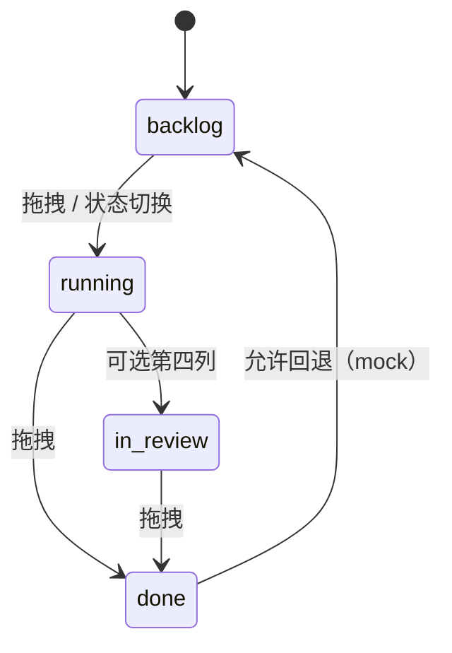

# Product Capability — Multi-Agent 平台 MVP 原型

## CAPABILITY

为本地单用户（林远）提供 **Multica 式 Agent 编排控制台的可交互 HTML 原型**，使其能在一屏内 mock 演示 Issue 看板状态流转、Squad 队长 briefing + @mention 委派、Agent/Skill 配置、以及 Wiki 浏览器占位。该能力 **不改变任何真实 CLI 进程或数据库**，仅通过前端 seed 数据与内存态交互证明产品设计与四层架构叙事，支撑毕设 PRD 签核与答辩 demo。

---

## CONSTRAINTS

### 固定规则（Fixed Policy）

| # | 规则 | 来源 |
|---|------|------|
| C-01 | 所有交付物写入 `D:\code\multi-agent\chanpin\` | problem-statement |
| C-02 | Must REQ 必须 100% 有 AC，禁止 orphan requirement | AGENTS.md 铁律 |
| C-03 | 原型不得 spawn 子进程、不得连接 PostgreSQL/WebSocket | PRODUCT-BRIEF Won't |
| C-04 | UI 交互对齐 Multica 三栏 + Trello 看板，不重新发明导航 | personas §5 |
| C-05 | 预置 1「产品小队」+ 6–10 Issue + 5 Wiki 页 | PRD demo 约束 |
| C-06 | 答辩高光路径 ≤3 分钟：Issue → Squad → briefing → @mention | jtbd §Insights |

### 不变量（Invariants）

| # | 不变量 | 违反后果 |
|---|--------|----------|
| I-01 | Issue assignee 仅 agent \| squad \| unassigned 三态 | assignee UI 语义混乱 |
| I-02 | Squad 必有且仅有一个 leader（agent） | briefing 路由失效 |
| I-03 | @mention pill 仅渲染，不触发 enqueue | scope 膨胀到真实 Multica |
| I-04 | 刷新后 mock 状态可重置为 seed（localStorage 为 Should） | demo 可复现性 |
| I-05 | Wiki 页面内容为静态 mock，无 ingest API | Phase 2 边界 |

### 信任边界（Trust Boundaries）

```
┌─────────────────────────────────────┐
│  浏览器原型（chanpin/prototype/）    │  ← MVP 能力边界
│  mock seed · 内存态 · 无 auth       │
└──────────────┬──────────────────────┘
               │ Phase 1+ 预留接口
┌──────────────▼──────────────────────┐
│  app/ 单进程（Phase 0–1）            │
│  SQLite · Backend adapter · daemon  │
└──────────────┬──────────────────────┘
               │ Phase 2+
┌──────────────▼──────────────────────┐
│  Wiki ingest · Memory 插件          │
└─────────────────────────────────────┘
```

### 数据所有权

| 实体 | 所有者 | MVP 存储 |
|------|--------|----------|
| Issue / Comment | Workspace | JS seed 对象 |
| Squad / Agent / Skill | Workspace | JS seed 对象 |
| Wiki 页面 | 项目知识库 | 静态 HTML/MD mock |
| 用户会话 | 单用户本地 | 无持久化（Should: localStorage） |

---

## IMPLEMENTATION CONTRACT

### Actors

| Actor | 类型 | MVP 交互 |
|-------|------|----------|
| 林远 | Human operator | 拖拽、点击、表单填写 |
| 策划队长 Agent | Mock agent | seed comment 作者 |
| 调研/PRD/原型 Agent | Mock agent | roster 成员、@mention 目标 |
| 王教授 | Read-only observer | 目视 + 点击 demo 路径 |

### Surfaces

| Surface | 路由/入口 | 主区内容 | 右栏 |
|---------|-----------|----------|------|
| Issue 看板 | 左栏 Issues | Kanban 三列 | 选中 Issue 属性 |
| Issue 详情 | 点击卡片 | 描述 + 时间线 | assignee + briefing |
| Agents | 左栏 Agents | Agent 列表/表单 | Agent 详情 + skills |
| Skills | 左栏 Skills | Skill 列表 + URL 导入 | — |
| Wiki | 左栏 Wiki | 树 + 页面阅读器 | 目录大纲（可选） |
| Squads | Agent 页或 Issue 上下文 | roster 视图 | leader 高亮 |

### States and Transitions

#### Issue Status



| 自 | 事件 | 至 | MVP 行为 |
|----|------|-----|----------|
| backlog | drag to running | running | 卡片移动，右栏 status 更新 |
| running | drag to done | done | 同上 |
| * | click card | — | 打开详情，不自动改状态 |

#### Assignee

| 自 | 事件 | 至 | 副作用 |
|----|------|-----|--------|
| unassigned | select agent | agent | 右栏显示 Agent 摘要 |
| unassigned | select squad | squad | 右栏显示 briefing 三段 |
| agent | select squad | squad | briefing 区出现 |
| squad | select agent | agent | briefing 区消失 |

#### Skill Import（mock）

| 自 | 事件 | 至 | 副作用 |
|----|------|-----|--------|
| — | valid URL + import | listed | 列表 +1，无网络请求 |
| listed | assign to agent | assigned | Agent.skills 数组更新 |

### Interfaces / Inputs / Outputs

#### Prototype Module Boundary（建议）

```
prototype/
├── index.html
├── data/
│   ├── seed.json          # Issue/Squad/Agent/Skill/Wiki
│   └── demo-script.md     # 答辩操作步骤
├── js/
│   ├── board.js           # ISS-001..002
│   ├── issue-detail.js    # ISS-004..007
│   ├── squad.js           # SQD-001..006
│   ├── agents.js          # AGT-001..004
│   ├── skills.js          # SKL-001..003
│   ├── layout.js          # NAV-001..004
│   └── wiki.js            # WIK-001..004
└── css/
    └── theme-dark.css     # NAV-004
```

#### Seed 数据最小集

| 实体 | 数量 | 必填字段 |
|------|------|----------|
| Issue | 6–10 | id, identifier, title, status, assignee?, comments[] |
| Squad | 1 | id, name, leaderId, memberIds[] |
| Agent | 3–4 | id, name, instructions, runtime, skills[], mcpServers[] |
| Skill | 4–6 | id, name, sourceUrl |
| WikiPage | 5 | id, path, title, contentHtml |

#### @mention 格式（渲染契约）

- 输入：comment 正文含 `@AgentName` 或 `[@Name](mention://agent/<uuid>)`
- 输出：DOM 元素 `.mention-pill` 带 data-agent-id
- 禁止：fetch / WebSocket / 触发 Agent run

### Data Model Implications

MVP **无数据库**。Phase 0 `app/` 迁移时：

| 原型字段 | 未来表/列 | 备注 |
|----------|-----------|------|
| Issue.status | issue.status enum | 简化为 3–4 值 |
| assignee.type + id | assignee_type, assignee_id | Multica 多态 |
| Squad.leaderId | squad.leader_id | FK → agent |
| Agent.runtime | agent.runtime | Phase 1 adapter key |

### Security / Policy

| 项 | MVP | Phase 1+ |
|----|-----|----------|
| Auth | 无 | 单用户 token 可选 |
| RBAC | 无 | Won't 企业 |
| Secret 存储 | 无 MCP key 实存 | env + 加密 |
| XSS | mock 内容可信（seed 自控） | sanitize user comment |

### Observability

| 项 | MVP | Phase 1+ |
|----|-----|----------|
| 日志 | console.debug 可选 | structured log |
| 指标 | 无 | task duration, queue depth |
| Demo 可复现 | seed 固定 + 重置按钮（Should） | — |

---

## NON-GOALS

本 capability 文档 **不覆盖**：

- `app/` 生产代码实现
- Backend adapter（Pi/Claude/opencode）spawn 逻辑
- Cursor headless 实装（Phase 1 Should/TBD）
- PostgreSQL schema / migration
- WebSocket EventBus
- Wiki ingest 管线
- Memory 向量检索
- Autopilot scheduler
- 14 CLI daemon 路由
- 单元测试 / E2E CI（原型队员可选 smoke）

---

## OPEN QUESTIONS

| # | 问题 | 状态 | 决策 |
|---|------|------|------|
| OQ-1 | 暗色主题默认？ | ✅ 已决 | 默认暗色 — NAV-004 |
| OQ-2 | Wiki mock 页数？ | ✅ 已决 | 5 页 — WIK-003 |
| OQ-3 | Cursor Phase 1 runtime？ | ✅ 已决（原型） | UI mock 含 Cursor；Phase 1 实装 Should/TBD |
| OQ-4 | 原型 tech stack？ | ⏳ 队员3 | HTML/CSS/JS 或轻量框架，队长不阻塞 |
| OQ-5 | localStorage 持久化？ | ⏳ Should | 建议有「重置 demo」按钮 |
| OQ-6 | 第四列 in_review？ | ⏳ 可选 | 有三列即可 Must；第四列 Should |

---

## HANDOFF

### 就绪状态

| 下游 | 状态 | 说明 |
|------|------|------|
| **原型队员 3** | ✅ Ready | PRD + RTM + 本 capability + handoff AC 齐全 |
| **Phase 0 `app/`** | ⏳ 待 MVP 签核 | 原型验证后再启动 |
| **队长 MVP 签核** | ⏳ 待原型 | utility-pm-critic checklist |

### 原型队员 3 交付清单

1. 读取 `docs/prd/multi-agent-platform.md` + RTM
2. 按 `docs/handoff/intent-mvp-prototype.md` 逐条 AC 自检
3. 产出 `chanpin/prototype/`，默认暗色三栏
4. seed：`产品小队` + 6–10 Issue + 5 Wiki 页
5. 答辩路径可 3 分钟点通
6. **禁止** scope creep 至 Won't 列

### ECC Lane 建议

- 原型实现 → 队员 3 HTML/CSS/JS
- MVP 签核 → 队长 utility-pm-critic
- Phase 0 后端 → `app/` spike + develop-adr（SQLite vs 单文件）

---

## Revision History

| Version | Date | Author | Changes |
|---------|------|--------|---------|
| 1.0 | 2026-07-08 | 产品·需求与PRD官 | 初版 capability contract |
