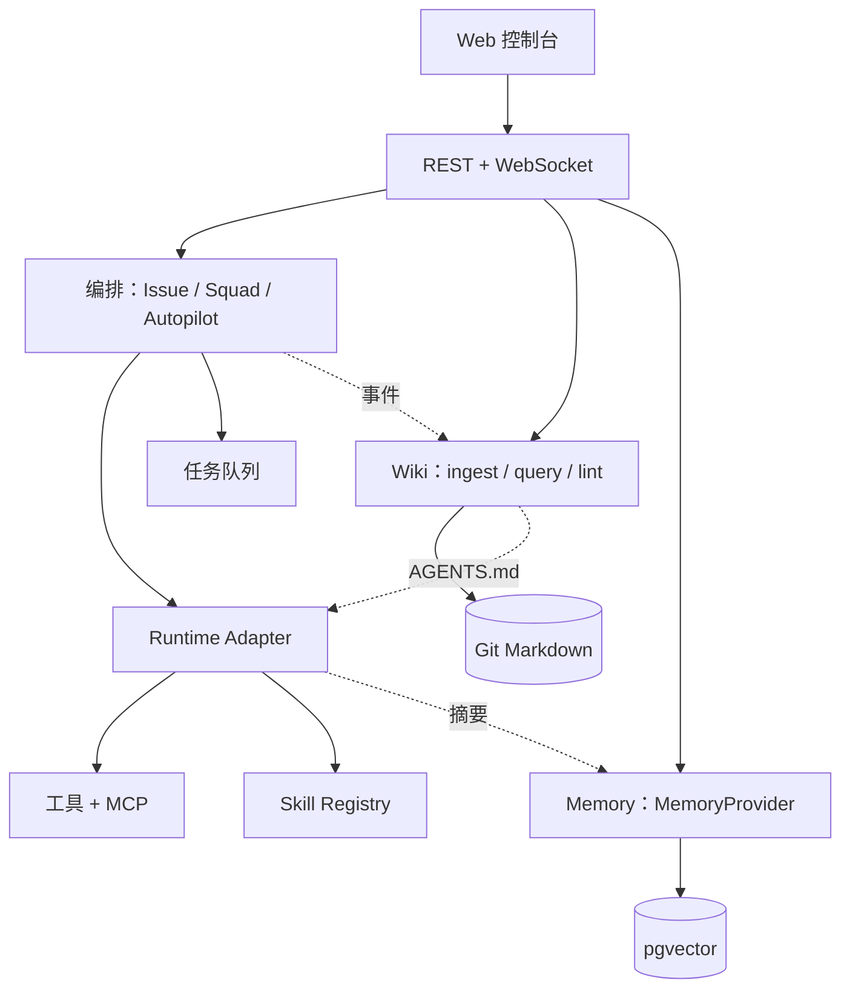

# 架构设计

> 更新：2026-07-08 · 技术栈已锁定 **TypeScript 全栈**（见 [synthesis.md](synthesis.md)）

## 1. 问题定义

**要做什么：** **纯本地**的多智能体编排平台 — 人在本地 Web 控制台上分配任务给 Agent，Agent 绑定并驱动本机已有的编码 CLI（Claude Code / opencode / Cursor / Pi…），产出写入**项目 Wiki**，经验写入**记忆层**。

> **进程模型：** 编排主进程（Node 长驻）+ 每个 agent 执行一个子进程（学 multica/pi 的方案 C 混合）。详见 [synthesis.md](synthesis.md) §进程模型。不是单进程——agent 是外部 CLI，必须 spawn 子进程。

**核心体验目标（按优先级，源自 multica 实际使用反馈）：**

| 优先级 | 功能 | 为什么重要 |
|---|---|---|
| ★★★★★ | **小队（Squad）** | 组长路由 + briefing 注入；人类只需对队长下指令，队长自主委派成员，这是 multica 最亮眼的设计 |
| ★★★★★ | **Issue 即任务中心** | 一个 issue = 一个任务的所有推进；队员汇报、工具调用、状态变更全在 issue 时间线里，人类一屏看清 |
| ★★★★ | **Agent ↔ 本地运行时绑定** | 每个 agent 绑定用户电脑上的一个 CLI（Claude Code / opencode / Cursor / Pi），平台发现并驱动它们，而非自己实现 Agent loop |
| ★★★★ | **Skill URL 导入 + 按智能体分配** | 从 URL 导入 skill，给每个 agent 配独立 skill 集 + 系统指令 |
| ★★★ | **每个 agent 的 MCP 支持** | agent 可连接 MCP server 扩展工具 |

**部署模型：纯本地，混合进程。** 基于 multica/pi 源码验证（见 [synthesis.md](synthesis.md) §进程模型）——

- ❌ 不做云端 server + 多节点 daemon 的分离架构
- ❌ 不需要 Redis relay、多节点 broadcaster、唤醒 WebSocket
- ✅ **编排主进程**（Node 长驻）：负责 agent 注册、任务派发、并发槽位（semaphore）、子进程崩溃处理、状态持久化、HTTP/WebSocket 服务
- ✅ **每个 agent 执行 = 一个子进程**：spawn `claude --output-format stream-json` 等 CLI，stdin/stdout 管道读流式事件（学 multica `pkg/agent/agent.go` + pi orchestrator 的 supervisor/worker 模式）
- ✅ 这是 multica 和 pi 在"编排外部 agent CLI"场景下的共同收敛方案（方案 C 混合）；hermes 的单进程线程池模式不适用，因为它的 agent 是进程内对象而非外部 CLI
- ✅ DB 可用 SQLite（Phase 0-2）或本地 PostgreSQL（Phase 3 起需向量）
- ✅ 「云端」唯一允许的出口：调用 LLM provider API（Anthropic/OpenAI/…）

**不做什么：**
- ❌ 20+ 消息平台 gateway（hermes 全量）
- ❌ multica 级 14 CLI 路由 —— 先 2-3 个 runtime（Pi + Claude Code + opencode）
- ❌ WeKnora 级多租户/RBAC（纯本地单用户）
- ❌ mem0 的 30+ vector store（先 pgvector 或 SQLite-vec）
- ❌ 云端任务托管 / 远程 agent 调度

**论文一句话：**

> 四层架构（编排-执行-知识-记忆），用「编译式项目 Wiki」+「可插拔记忆」解决 RAG 不累积、执行不可追踪、跨会话上下文丢失。

---

## 2. 目标架构



### 四层职责

| 层 | 职责 | 参考 |
|---|---|---|
| 编排 | 任务 CRUD、assignee、状态机、WS 进度 | [orchestration.md](../references/orchestration.md) |
| 执行 | Agent 循环、tool calling、子任务、adapter | [runtime.md](../references/runtime.md) |
| 知识 | Raw→Wiki、index/log、lint/health | [wiki.md](../references/wiki.md) |
| 记忆 | 跨会话检索、entity 链接 | [memory-and-skills.md](../references/memory-and-skills.md) |

### 关键设计决策

1. **Wiki 与 Memory 分离** — Wiki 可读、Git 版本化；Memory 供 Agent 检索、可压缩。
2. **AGENTS.md 作桥梁** — Wiki ingest 后更新 workspace 级宪法，runtime 启动时加载。
3. **编排事件驱动 Wiki ingest** — Issue 完成 / PR / comment 触发增量更新。
4. **MemoryProvider ABC** — 先 pgvector，预留 Graphiti / gbrain。
5. **Skill 不进 core tool schema** — 参考 hermes Footprint Ladder。

---

## 3. 技术选型（一人友好 · 纯本地）

| 组件 | 选择 | 理由 |
|---|---|---|
| 语言 | **TypeScript 全栈** | 你熟悉；前后端共享类型；Pi 原生 TS |
| Monorepo | pnpm workspace | 轻量；TS 友好 |
| 后端框架 | Hono 或 Fastify | Hono 更现代，Fastify 生态成熟 |
| ORM | Drizzle | sqlc 风格类型安全；最接近 multica 的 sqlc 体验 |
| DB | **SQLite**（Phase 0-2）→ PostgreSQL+pgvector（Phase 3） | 纯本地零配置；任务表用 SQLite 够；记忆层要向量时再升 |
| 实时 | `ws`（WebSocket） | multica 用 gorilla/ws 验证过；纯本地主进程内同步 EventBus，不需要 Redis |
| 前端 | Next.js (App Router) | multica / WeKnora 同路线 |
| 前端状态 | React Query + Zustand | multica 已验证组合 |
| 执行层 | **多 Backend adapter**（非单一 runtime） | 每个 agent 绑定一个本机 CLI，见下方「执行层」 |
| LLM 调用 | 执行层各 CLI 自带；Wiki/Memory 用 LangChain.js | 不重叠 |
| 校验 | Zod | 全栈共享 schema |

### 执行层：多运行时绑定（学 multica Backend 抽象）

**核心理念：平台不自造 Agent loop，而是驱动用户本机已有的编码 CLI。** 每个 agent 定义时绑定一个 runtime，平台通过统一的 `Backend` 接口发现并驱动它。

```typescript
// 学 multica 的 pkg/agent/agent.go:16 Backend 接口
interface RuntimeBackend {
  readonly name: string;              // "pi" | "claude-code" | "opencode" | "cursor"
  detect(): Promise<boolean>;         // 本机是否装了这个 CLI
  execute(input, onEvent, signal): Promise<ExecutionResult>;
}
```

| Backend | 怎么驱动 | 接入优先级 |
|---|---|---|
| **Pi** | `createAgentSession()` 进程内 SDK 嵌入（TS 原生，最低延迟） | Phase 0（验证闭环） |
| **Claude Code** | spawn `claude --output-format stream-json`，解析 stdout stream | Phase 1 |
| **opencode** | spawn `opencode` CLI，解析其流式输出 | Phase 1 |
| **Cursor** | 调研其 headless/CLI 能力 | Phase 2+ |

**发现机制**（学 multica daemon 的 `LoadConfig`）：启动时 `which`/`LookPath` 探测本机装了哪些 CLI，暴露给用户在创建 agent 时选择绑定。

### 对齐策略

后端结构学 multica（DB行即锁状态机 + 多态指派 + Squad + Backend 抽象），执行层多运行时学 multica daemon，记忆/扩展设计学 hermes（MemoryProvider ABC + Footprint Ladder），Wiki 工作流学 llm-wiki-agent，CLI 契约学 WeKnora。详见 [synthesis.md](synthesis.md)。

---

## 4. 数据模型（草案）

```
Workspace
├── id, name, repo_url
├── agents[]        → AgentProfile
├── issues[]
├── wiki_root
└── agents_md

Issue
├── status: backlog | ready | running | done | failed
├── assignee: human | agent | squad
├── runtime_job_id
└── events[]

WikiPage
├── type: source | entity | concept | synthesis
├── path, frontmatter, wikilinks[]
└── source_refs[]

MemoryEntry
├── scope: workspace | agent | issue
├── embedding, text, metadata
└── provenance
```

---

## 5. Related Work 差异化

| 参考 | 它解决什么 | 本毕设差异 |
|---|---|---|
| multica | 多 CLI 托管 | + Wiki/Memory 联动 |
| hermes | 个人全功能 runtime | 团队看板 + 项目 Wiki |
| WeKnora | 企业 RAG+Wiki | 轻量 + 编排事件驱动 ingest |
| llm-wiki | 个人 Wiki 模式 | 绑定 Issue/Agent 生命周期 |
| mem0/graphiti | 记忆后端 | 可插拔 + 对比实验 |
