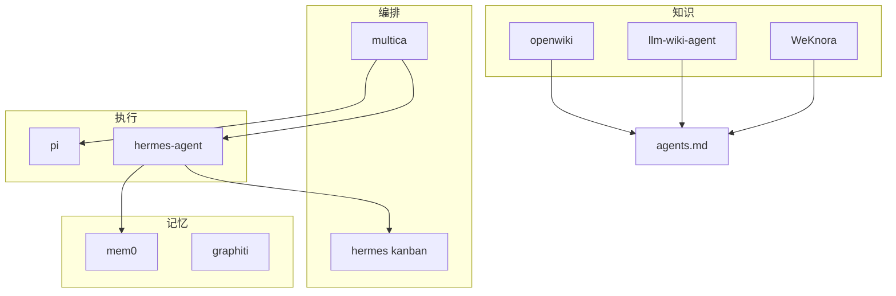

# 参考项目总览

> 源码：`references/repos/` · 更新：2026-07-08

## 矩阵

| 项目 | 一句话 | 技术栈 | 分层 | 优先级 |
|---|---|---|---|---|
| multica | Agent 当同事的任务看板 | Go + Next.js | 编排 | ★★★★★ |
| hermes-agent | 全平台 Agent 运行时 | Python + 插件 | 执行 | ★★★★★ |
| pi | 可嵌入 Agent Harness | TS monorepo | 执行 | ★★★★ |
| WeKnora | RAG + Agent + Auto-Wiki | Go + React | 知识+平台 | ★★★★ |
| openwiki | 仓库文档 CLI | TS + DeepAgents | 知识 | ★★★★ |
| llm-wiki-agent | Agent 维护 Wiki | AGENTS.md 工作流 | 知识 | ★★★★ |
| OpenDeepWiki | 企业仓库知识库 | .NET + Next.js | 知识 | ★★★ |
| deepwiki-open | 轻量 Wiki demo | Python | 知识 | ★★ |
| mem0 | 向量记忆层 | Python/TS | 记忆 | ★★★★ |
| graphiti | 时序上下文图 | Python + Neo4j | 记忆 | ★★★★ |
| gstack | 工程 Skill 库 | Bun | 方法论 | ★★★ |
| agents.md | AGENTS.md 规范 | 官网 | 契约 | ★★★★ |

## 分层索引

| 层 | 分析文档 | repos |
|---|---|---|
| 编排 | [orchestration.md](orchestration.md) | multica, hermes(kanban) |
| 执行 | [runtime.md](runtime.md) | hermes-agent, pi |
| 知识 | [wiki.md](wiki.md) | openwiki, WeKnora, llm-wiki-agent… |
| 记忆/Skill | [memory-and-skills.md](memory-and-skills.md) | mem0, graphiti, gstack |

## 关系图

## 对比维度（论文用）

| 维度 | multica | hermes | Wiki 系 | mem0 | graphiti |
|---|---|---|---|---|---|
| 持久化 | PostgreSQL | SQLite | Git MD | Vector | Graph |
| 实时性 | WebSocket | Gateway | CI/批处理 | 增量 | 增量 episode |
| 扩展性 | daemon | 插件+skill | AGENTS.md | Provider ABC | Driver ABC |

## 概念层

Wiki 理论（与具体 repo 无关）：[../concepts/llm-wiki-pattern.md](../concepts/llm-wiki-pattern.md)
